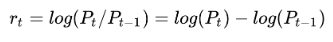

# Methods of Calculating Returns

Stock pricing data is time series data and thus, by nature of time series data, we observe trends and seasonality in the prices.

We transform these fluctuating prices into stationary returns to be able to manipulate the prices with statistical modeling.

Common types of returns include:

1. Simple Return: This is the weighted sum of the returns of the individual assets in the portfolio. Simple returns are defined as:

2. Log Return: This is the sum of the log returns of the days within a given month. Log returns are defined as:

We will can calculate the simple daily cumulative returns using the simple return values. To do so, we will be using the cumprod() method. We first add 1 (100%) to the simple returns before using the cumprod() method as in the following formula:

