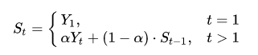

# 3 - Moving Averages and Volatility

It's time to dive into the fundamentals of strategy building.

We'll be focusing on 2 very important concepts:

Moving Averages

a. Simple Moving Average
b. Cumulative Moving Average
c. Exponential Moving Average

Volatility Calculation
In finance, a moving average (MA) is a stock indicator that is commonly used to analyze stock prices by creating a series of averages of different subsets of the full data set. The reason for calculating the moving average of a stock is to help smooth out the price data by creating a constantly updated average price. Generally, types of moving averages include simple, cumulative or weighted forms.

Simple Moving Average: In financial applications, a simple moving average (SMA) is the unweighted mean of the previous n data. For example, we may use a SMA for a 30 day period.

Cumulative Moving Average: In a cumulative moving average (CMA), we take the unweighted mean of all the previous data points relative to our current data point.

Exponential Moving Average: An exponential moving average (EMA), also known as an exponentially weighted moving average (EWMA) is a weighted moving average in which the weights of all the points previous to the current point exponentially decrease. This therefore places a greater weight and significance on the most recent data points.

The EMA for a series Y may be calculated recursively:

Where:

The coefficient α represents the degree of weighting decrease, a constant smoothing factor between 0 and 1
A higher α discounts older observations faster
Yt is the value at a time period t
St is the value of the EMA at any time period t
Volatility: volatility is a reflection of the degree to which a price moves. A stock with a price that fluctuates wildly, hits new highs and lows, or moves erratically is considered highly volatile. A stock that maintains a relatively stable price has low volatility. Numerous metrics measure volatility in differing contexts, and each trader has favorites. We will be taking the standard deviation of the previous n days and multiplying it with the square root of n.

Now that we have covered theory, it's time to implement all of this in Python!

